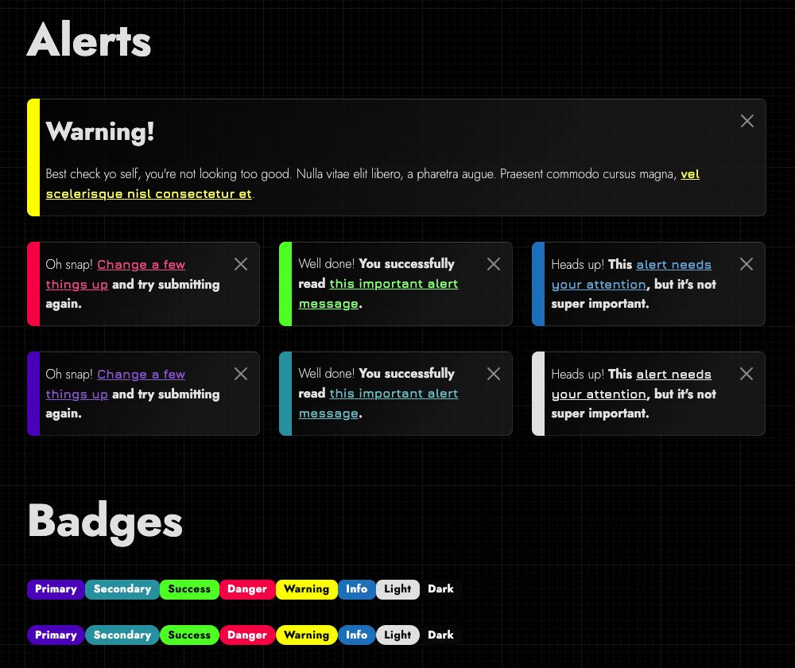
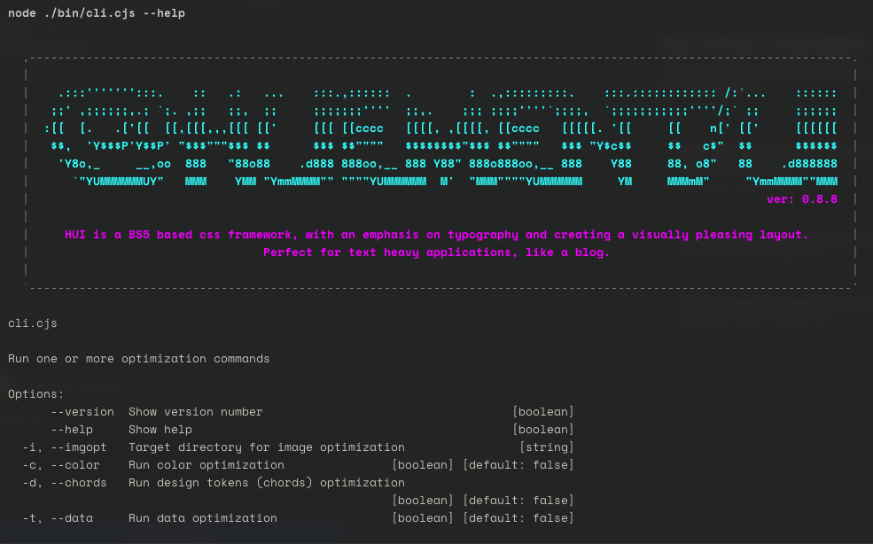

<h1 align="center">
  <br>
  
  <br>
</h1>


[](https://www.npmjs.com/package/@huement/ui)


> using Bootstrap 5 to create a 'visually pleasing' harmonic layout. Content focused with a neat typographic system.

---

**Abstract**

**@huement/ui** aka **hui**, really shines when used in a text heavy content setting, such as a blog page, where it can greatly improve the overall reading experience.

**hui** is easily configured via SCSS `$_Variables`. You know the drill, load in your custom variables, then build with `npm run build` to produce a CSS file. Simply load that resulting CSS file into whatever HTML5 based application you're developing and you're good to go! Alternatively before you run any code, you can install the precompiled CSS provided in the repo, or play around with the kitchensink HTML demo, either way are a great way to try things out first.

---

### TODO LIST

This is everything I want to get done before I would consider this usable. 

+ add in vertical units for each viewport size
  + V1 = $chord['vertical'] x $chord['scale'] x 1 
  + V2 = $chord['vertical'] x $chord['scale'] x 2 
  + through to V10 for each viewport
+ Get blog site changes added
+ Finalize CLI Tools for token generation
+ Finalize ICON toolkit
+ FontFace Variable Font Support

_____

# TABLE OF CONTENTS

- [TABLE OF CONTENTS](#table-of-contents)
  - [━▶ SECTIONS OVERVIEW](#-sections-overview)
  - [━▶ INSTALLING](#-installing)
    - [━▶ Updating](#-updating)
  - [━▶ SCSS Framework Building](#-scss-framework-building)
    - [STYLE + DESIGN TOKENS](#style--design-tokens)
  - [━▶ Command Line Tool](#-command-line-tool)
    - [⬦ Colors](#-colors)
    - [⬦ Typography Chords](#-typography-chords)
  - [🚀 Future Timeline](#-future-timeline)
    - [Short-Term (Next Release)](#short-term-next-release)
    - [Mid-Term (v1.0)](#mid-term-v10)
    - [Long-Term](#long-term)


## ━▶ SECTIONS OVERVIEW

hui is designed to be SIMPLE! The folder structure is a testament to that principle.

1. **bin** ❱ command line scripts used to build the library
2. **dist** ❱ finalized output with built css & js
3. **js** ❱ javascript portion of the framework
4. **scss** ❱ SCSS stylesheet part of the framework
5. **tokens** ❱ design tokens containing colors and fonts etc.

> NOTES:
> • /dist/ is routinely deleted. Never attempt to make a permanent change to anything in that folder directly. Modify /scss/ and rebuild.

---

## ━▶ INSTALLING

```shell
 $ npm install @huement/ui
```

### ━▶ Updating

Updating the library involves pushing a new version to NPM.

```shell
 $ npm install @huement/ui
```

> TODO: npm install (needs to be added to npm)
> TODO: HTML snippets < link href='' />
> TODO: SCSS import snippet

---

## ━▶ SCSS Framework Building

The components and everything you love from Bootstrap are all topped off and ready to run



### STYLE + DESIGN TOKENS

1. **tokens/icons** ❱ TODO Fantasticon details
2. **tokens/chords.json** ❱ TODO explain how to generate this
3. **stack.json + color_tokens.json** ❱ TODO sort out the token color files

Token files are easily created and when used in conjuction with the CLI, you can quickly create stunning themes in a second! This includes entire 'stacks'

```json
"theme": [
  {"primary": "7405a9"},
  {"secondary": "0fb2aa"},
  {"success": "34fc35"},
  {"warning": "fbff12"},
  {"danger": "ff0054"},
  {"info": "1982c4"},
  {"light": "C7C7C7"},
  {"dark": "4c4c4c"},
  {"black": "0F0F0F"},
  {"white": "FEFEFE"}
]
```

Creates a `_palette.scss` file that is filled with all your colors. 

```scss

$blue-100: #003454 !default;
$blue-200: #004570 !default;
$blue-300: #00568C !default;
$blue-400: #0068A8 !default;
$blue-500: #1982c4 !default;
...
// etc etc more colors 

```
---

## ━▶ Command Line Tool

The `/bin/` directory in the root of the repository contains a number of scripts that are used to build **HUI** and can assist you in creating a custom version of the library as well as the icon kit.

```shell
 node bin/cli.cjs
```

<div style="width:100%;padding:2rem 0;">
  
</div>

Running that main command will allow you to use a menu and easily access the other scripts and their parameters.

### ⬦ Colors

Using the `tokens/color_tokens.json` file HUI's CLI will generate a complex `.scss` file complete with all the relevant colors as well as the generated stacks for each of the colors listed. so `.blue-100` through to `.blue-900` color classes.

```shell
  # run either one of these commands to generate the scss palette file
  > node ./bin/cli.cjs --color
  > npm run build:colors

```

To change the palette simply update the tokens file and then rerun the command. 

It will automatically place the resulting SCSS file into `scss/hui/_palette.scss`. This allows us to always keep the colors linked up in the `scss/hui/_colors.scss` which is a fairly static file, while the palette should only ever be autogenerated, dont edit it manually as your changes will be overwritten each time it updates. Any changes should be made in the colors file.

### ⬦ Typography Chords

In trying to create a **"HARMONIC"** layout, one that is visually pleasing, HUI attempts to break your typography into different chords. A Chord in music a combination of notes at the same time, in our CSS file, a chord is all the type settings for a given breakbreak. So how does H1 - H6 look at 500px vs how they are going to read at 1500px.

By treating each screen size as a different chords, it helps you keep in mind not just the screen size, but the atmosphere around that screen. Think about listening to a video on your phone vs on your TV. Totally different expereinces, and its not just because the screen is bigger. For that reason, on mobile phones, readability is important, but so is size. Large margins on smaller screens annoy your users, and create unwanted or unintended breaks when things are crunched down to one massive column.

.... etc more about chords get other markdown files pasted in here.

> TODO: add in info about the CLI typography chords command


## 🚀 Future Timeline

HUI is under active development! Here’s a look at what’s coming in future versions:

### Short-Term (Next Release)
- **Improved Documentation:** More detailed guides and usage examples.
- **Expanded Design Tokens:** Additional color, spacing, and typography tokens for greater flexibility.
- **CLI Enhancements:** More robust CLI options for generating and customizing palettes and typography chords.
- **Bug Fixes & Stability:** Ongoing improvements to SCSS structure and build process.

### Mid-Term (v1.0)
- **Component Library:** Ready-to-use, accessible UI components (alerts, modals, navs, etc.)
- **Theme System:** Easy theming and dark mode support via tokens and variables.
- **Customizable Utility Classes:** More utility-first options for rapid prototyping.
- **Better Bootstrap Integration:** Smoother overrides and compatibility with Bootstrap updates.

### Long-Term
- **Plugin Ecosystem:** Support for third-party plugins and extensions.
- **Live Playground:** Interactive web playground for trying out HUI features and generating code snippets.
- **Performance Optimizations:** Smaller bundle sizes and faster builds.
- **Internationalization:** Improved RTL and localization support.

---

*Have a feature request or want to contribute? Open an issue or PR on GitHub!*

---

```
 @huement/ui |  HUEMENT USER INTERFACE
     version |  0.9.*
    codename |  mojo
```

---


