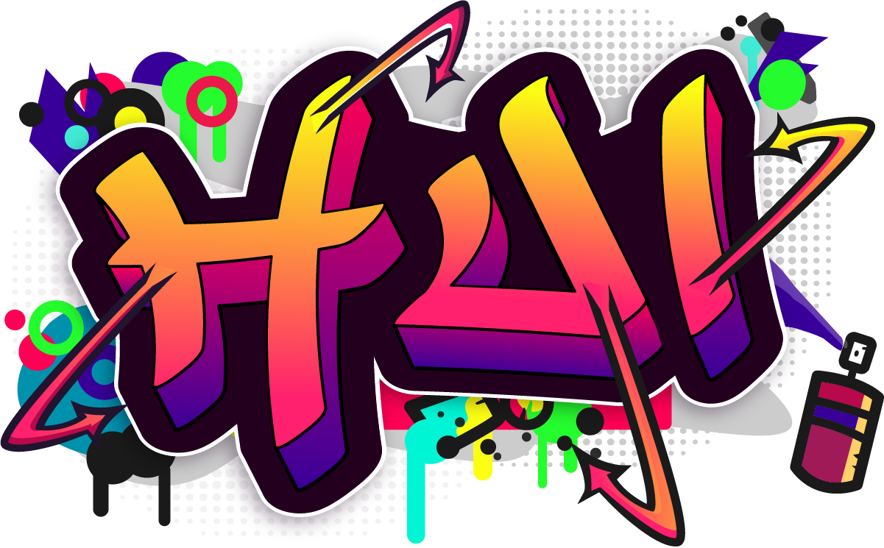

<h1 align="center">
  <br>
  
  <br>
</h1>


[](https://www.npmjs.com/package/@huement/ui)


> using Bootstrap 5 to create a 'visually pleasing' harmonic layout. Content focused with a neat typographic system.

------------------------

**Abstract**

**@huement/ui** aka **hui**, really shines when used in a text heavy content setting, such as a blog page, where it can greatly improve the overall reading experience.

**hui** is easily configured via SCSS `$_Variables`. You know the drill, load in your custom variables, then build with `npm run build` to produce a CSS file. Simply load that resulting CSS file into whatever HTML5 based application you're developing and you're good to go! Alternatively before you run any code, you can install the precompiled CSS provided in the repo, or play around with the kitchensink HTML demo, either way are a great way to try things out first.

------------------------

# TABLE OF CONTENTS

- [TABLE OF CONTENTS](#table-of-contents)
  - [━▶ SECTIONS OVERVIEW](#-sections-overview)
  - [━▶ INSTALLING](#-installing)
  - [━▶ SCSS Framework Building](#-scss-framework-building)
    - [STYLE + DESIGN TOKENS](#style--design-tokens)
  - [━▶ SVG Icon Font Tools](#-svg-icon-font-tools)
  - [━▶ Command Line Tool](#-command-line-tool)
    - [⬦ Colors](#-colors)
    - [⬦ Typography Chords](#-typography-chords)

------------------------

## ━▶ SECTIONS OVERVIEW

hui is designed to be SIMPLE! The folder structure is a testament to that principle.

1. **bin** ❱ command line scripts used to build the library
2. **dist** ❱ finalized output with built css & js
3. **js** ❱ javascript portion of the framework
4. **scss** ❱ SCSS stylesheet part of the framework
5. **tokens** ❱ design tokens containing colors and fonts etc.

> NOTES:
> • /dist/ is routinely deleted. Never attempt to make a permanent change to anything in that folder directly. Modify /scss/ and rebuild.

------------------------

## ━▶ INSTALLING

```shell
 $ npm install @huement/ui
```

> TODO: npm install (needs to be added to npm)
> TODO: HTML snippets < link href='' />
> TODO: SCSS import snippet

------------------------

## ━▶ SCSS Framework Building

> TODO: this part needs a lot of work

### STYLE + DESIGN TOKENS

1. **tokens/icons** ❱ TODO Fantasticon details
2. **tokens/chords.json** ❱ TODO explain how to generate this
3. **stack.json + color_tokens.json** ❱ TODO sort out the token color files

------------------------

## ━▶ SVG Icon Font Tools

> TODO: this part needs a lot of work

------------------------

## ━▶ Command Line Tool

The `/bin/` directory in the root of the repository contains a number of scripts that are used to build **HUI** and can assist you in creating a custom version of the library as well as the icon kit.

```shell
 node bin/cli.cjs
```

Running that main command will allow you to use a menu and easily access the other scripts and their parameters.

### ⬦ Colors

> TODO: add in info about the CLI colors command

### ⬦ Typography Chords

In trying to create a **"HARMONIC"** layout, one that is visually pleasing, HUI attempts to break your typography into different chords. A Chord in music a combination of notes at the same time, in our CSS file, a chord is all the type settings for a given breakbreak. So how does H1 - H6 look at 500px vs how they are going to read at 1500px.

By treating each screen size as a different chords, it helps you keep in mind not just the screen size, but the atmosphere around that screen. Think about listening to a video on your phone vs on your TV. Totally different expereinces, and its not just because the screen is bigger. For that reason, on mobile phones, readability is important, but so is size. Large margins on smaller screens annoy your users, and create unwanted or unintended breaks when things are crunched down to one massive column.

.... etc more about chords get other markdown files pasted in here.

> TODO: add in info about the CLI typography chords command
>
------------------------

```
 @huement/ui |  HUEMENT USER INTERFACE
     version |  0.8.*
    codename |  mojo
```
