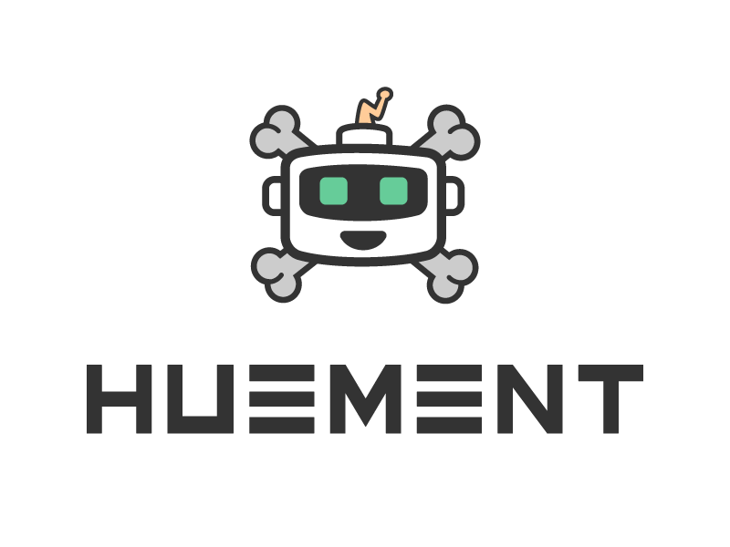

<p align="center">
  
</p>

<div style="width: 100%;clear:both;display:block;position:relative">
  <p align="center" style="width:24%;float:left;height:50px">
    
  </p>
  <p align="center" style="width:24%;float:left;height:50px">
    
  </p>
  <p align="center" style="width:24%;float:left;height:50px">
    
  </p>
  <p align="center" style="width:24%;float:left;height:50px">
    
  </p>
</div>
<div style="width: 100%;clear:both;display:block;position:relative">
  <p align="center">
    <strong>@huement/ui</strong> [hui] is content focused, minimal front-end framework, with an emphasis on creating a 'visually pleasing' layout & typographic system.
  </p>
</div>
<br />

Based on Bootstrap 5's sass framework, it really shines when used in a text heavy content setting, such as a blog page, where it can greatly improve the overall reading experience.

**@huement/ui** is **not** a full featured theme for bootstrap 5, nor is it suitable for building complex applications with intricate ui's that process data and allow end users to perform actions. Instead, use it on a blog, or a simple landing page, a one off project index.html page etc.

**hui** is easily configured via `$SCSS_Variables` then build with `npm run css` to produce a CSS file _(and optionally a custom SVG based icon font)_. Simply load that resulting CSS file into whatever HTML5 based application you're developing and you're good to go!

#### INSTALLING

> TODO: npm install (needs to be added to npm)
> TODO: HTML snippets < link href='' />
> TODO: SCSS import snippet

## • SECTIONS

hui is designed to be SIMPLE! The folder structure is a testament to that principle.

1. **bin** ❱ command line scripts
2. **dist** ❱ finalized output
3. **public** ❱ static files
4. **src** ❱ SCSS framework
5. **tokens** ❱ design variables
6. **web** ❱ documentation & demo content

> NOTES:
> • Everything in the public folder is copied to the /dist/ folder on build.
> • /dist/ is routinely deleted. Never attempt to make a permanent change to anything in that folder directly. Modify /src/ and rebuild.

---

### SCSS FRAMEWORK

> TODO: this part needs a lot of work

### STYLE + DESIGN TOKENS

1. **tokens/icons** ❱ TODO Fantasticon details
2. **tokens/chords.json** ❱ TODO explain how to generate this
3. **stack.json + color_tokens.json** ❱ TODO sort out the token color files

---

### ⬦ public

So the directory structure goes like this:

```sh
   ━━❪ public ❫
   ━━━▶ demo
   ━━━▶ favicon
   ━━━▶ fonts
```

---

### • web

## INSTALL

...

```
 @huement/ui |  HUEMENT USER INTERFACE
     version |  0.1.*
    codename |  mojo
```
